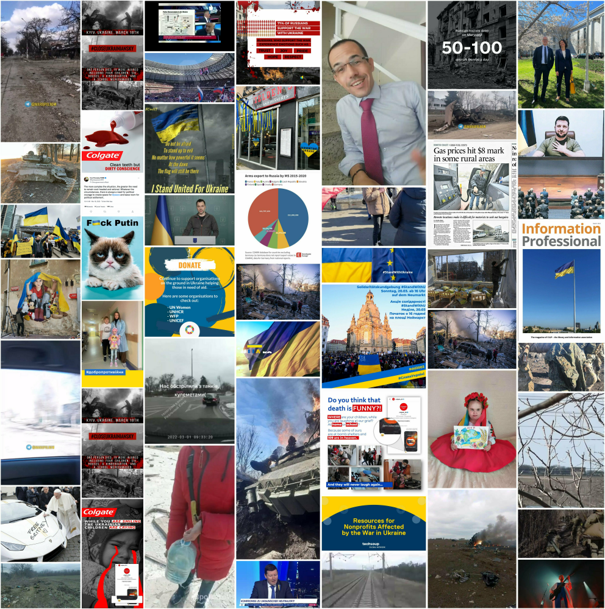
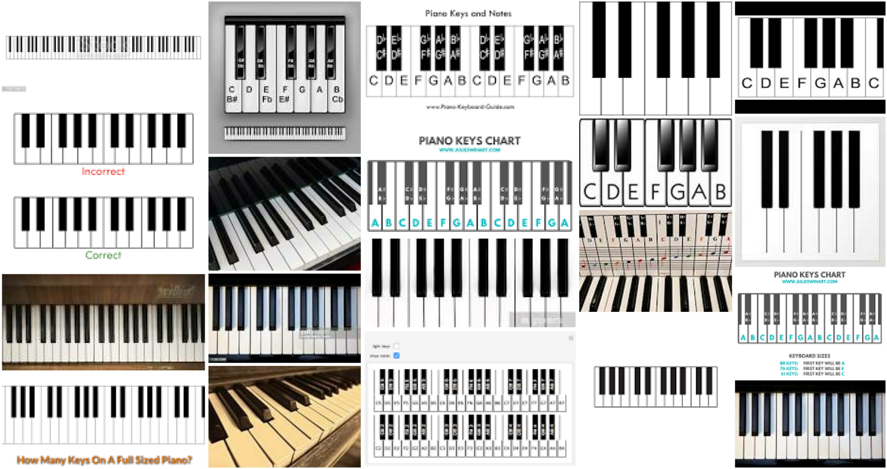

# photomoe

## Download images

``` r
library(tidyverse)

tweets_df1 <- rtweet::search_tweets("#standwithukraine", 
                                    n = 1000, 
                                    include_rts = F) 

tweet_pics <- tweets_df1 %>% filter(!is.na(media_url)) 
```

``` r
photomoe::img_download_images(link = unlist(tweet_pics$media_url)[1:49], 
                              dir = tempdir(), 
                              prefix = 'uk', 
                              scale_border = T)
```

### Build collage

The `img_build_collage` function builds a collage per a user specified
directory of images – based on the `magick` package and this
[post](https://masalmon.eu/2017/03/19/facesofr/).

``` r
photomoe::img_build_collage(dir = tempdir(), 
                             dimx = 7, 
                             dimy = 7, 
                             prefix = 'uk')
```



### Google image links

``` r
search1 <- 'pointing at rainbows'
search2 <- 'piano keys'
links <- lapply(list(search1, search2), 
                photomoe::img_get_gurls)
```

#### pointing at rainbows

``` r
photomoe::img_download_images(link = links[[1]], 
                               dir = tempdir(), 
                               prefix = search1, 
                               scale_border = T)

photomoe::img_build_collage(dir = tempdir(), 
                             dimx = 5, 
                             dimy = 4, 
                             prefix = search1)
```


#### piano keys


