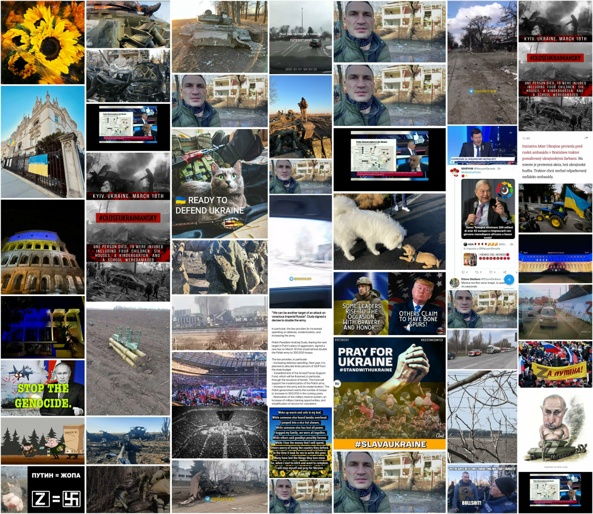
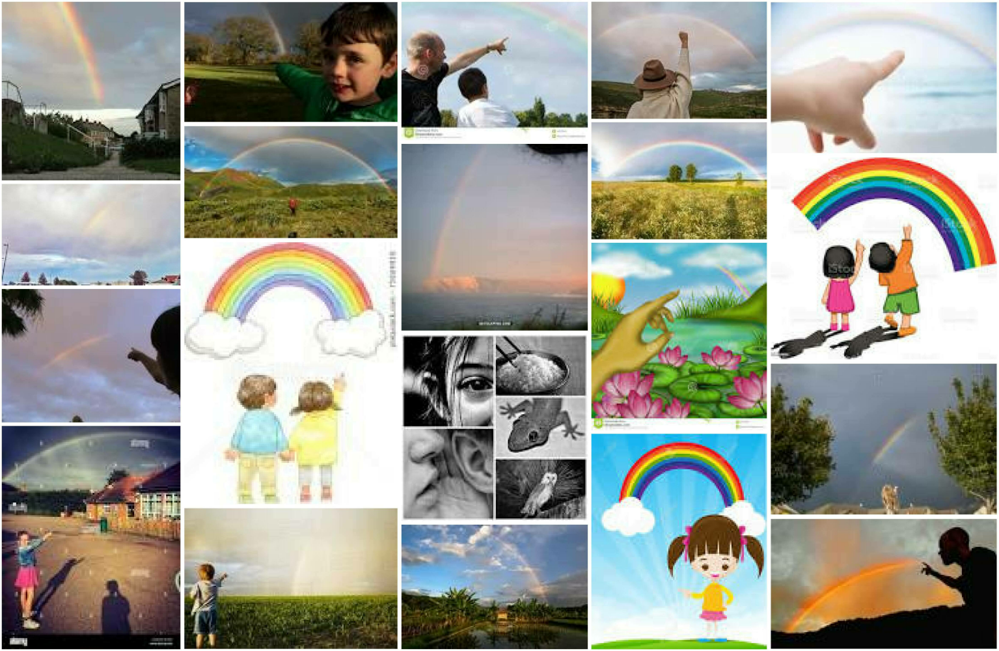
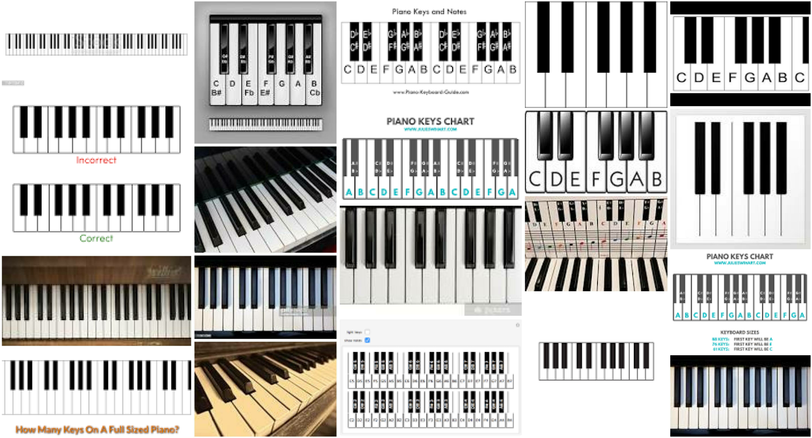

# photomoe

A simple package for downloading and collaging photos from online
sources. `magick` does all the heavy lifting. You can download the
development version from GitHub with:

``` r
devtools::install_github("jaytimm/photomoe")
```

## Download images

``` r
tweet_pics <- rtweet::search_tweets("#standwithukraine", 
                                    n = 1000, 
                                    include_rts = F) %>%
  filter(!is.na(media_url)) 
```

``` r
photomoe::img_download_images(link = unlist(tweet_pics$media_url)[1:49], 
                              dir = tempdir(), 
                              prefix = 'uk', 
                              scale_border = T)
```

## Build collage

The `img_build_collage` function builds a collage per a user specified
directory of images – based on the `magick` package and this [very nice
post](https://masalmon.eu/2017/03/19/facesofr/).

### #standwithukraine

``` r
photomoe::img_build_collage(dir = tempdir(), 
                            dimx = 7, 
                            dimy = 7, 
                            prefix = 'uk')
```



## Google image links

``` r
search1 <- 'pointing at rainbows'
search2 <- 'piano keys'
links <- lapply(list(search1, search2), 
                photomoe::img_get_gurls)

head(links[[1]])
```

    ## [1] "https://encrypted-tbn0.gstatic.com/images?q=tbn:ANd9GcS4Mv5KDtHbmrGK4rSeEhn4u-5xAYFRE4AE0LuUn2U5qYIomx-Ij7TXBnZ3Gw&s" 
    ## [2] "https://encrypted-tbn0.gstatic.com/images?q=tbn:ANd9GcQxjklOoNjDIBOntj6Fum-xTma5VwHTggPqSO-wwVD7TunYNWTAPpGuL_t_ezQ&s"
    ## [3] "https://encrypted-tbn0.gstatic.com/images?q=tbn:ANd9GcRkKXk25o5JJFJgWXXO6Zu_KyCjhEHpgAXDKkWj-idZLTRW1iFDQzVmrNnG3Q&s" 
    ## [4] "https://encrypted-tbn0.gstatic.com/images?q=tbn:ANd9GcQgMnJHvMy6f1fgPC152DALaHOTZ0WGWY_cbMMEts-IIQww6GYsLd9N6nvHow&s" 
    ## [5] "https://encrypted-tbn0.gstatic.com/images?q=tbn:ANd9GcTh-dK6cw_80ITJVjT1NmJYMCjrmAUaEZNoofWgcg0aDANHgJnrzKhL8_ATkg&s" 
    ## [6] "https://encrypted-tbn0.gstatic.com/images?q=tbn:ANd9GcTBz0ZgJ8_sovfIrFExRnheN-GFqxLRQnLL-_jyBXvmixrF7QfslTi1iUj1-Q&s"

### pointing at rainbows

``` r
photomoe::img_download_images(link = links[[1]], 
                              dir = tempdir(), 
                              prefix = search1, 
                              scale_border = T)

photomoe::img_build_collage(dir = tempdir(), 
                            dimx = 5, 
                            dimy = 4, 
                            prefix = search1)
```



### piano keys


